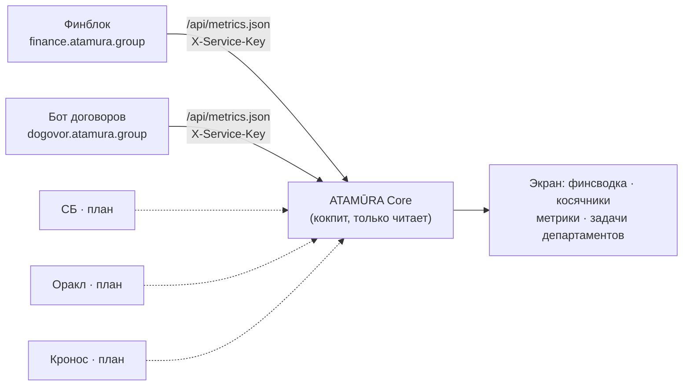

# ATAMŪRA Core — кокпит

Одна админ-панель **НАД** продуктами холдинга (финблок / бот договоров / СБ / Кронос / Оракл).

**Принцип:** кокпит **только читает снимки** продуктов и агрегирует — логику продуктов **не дублирует**.
Каждый продукт остаётся своим сервисом со своей БД; Core собирает у них read-only данные и рисует единый экран.

```
Финблок ─┐
Договоры ─┤
СБ ───────┤──►  ATAMŪRA Core  ──►  финсводка · косяки инициаторов · метрики · задачи департаментов
Кронос ───┤
Оракл ────┘
```

## Схема данных

Каждый продукт отдаёт read-only снимок (`/api/metrics.json` с сервис-ключом). Кокпит их читает,
агрегирует и рисует — **своей логики и своей БД у него нет**.



**Как часто обновляется:** страница тянет снимки при загрузке и дальше **сама раз в минуту**
(в шапке — «обновлено HH:MM»). Сами данные меняются в темпе продуктов: финблок — при срезе 1С
(≈каждые 2 ч), бот договоров — при каждой генерации договора.

## Запуск (локально)

```bash
python server.py            # → http://127.0.0.1:8090
```

Всё через env, все опциональны:

| env | зачем |
|---|---|
| `CORE_PORT` | порт (8090) |
| `DOGOVOR_LOGS` | папка логов генераций бота договоров (по умолч. `../atamura-dogovor-bot/logs/generations`) |
| `FINANCE_URL` | база финблока (напр. `https://finance.atamura.group`) для финсводки |
| `FINANCE_KEY` | X-Service-Key финблока |
| `BITRIX_WEBHOOK` | резолвить инициатора ID → Фамилия (иначе показываем ID) |

Секреты (`FINANCE_KEY`, `BITRIX_WEBHOOK`) — только в окружении, **не в код и не в git**.

## Что уже есть (стадия 1)

- **Косяки инициаторов** — из логов генераций бота договоров: рейтинг по фамилии/ID инициатора,
  сколько заявок, сколько косяков, топ-тип (БИН не совпал / сумма не указана / директор-устав / порядок оплаты / тип договора).
  На карточку берётся последняя генерация (перегенерации не задваивают).
- **Финсводка** — снимок финблока по `FINANCE_URL` (оборот/сальдо/матч 1С); мягко деградирует, если не подключён.

## Дальше

- Резолв имён инициаторов через Bitrix (`BITRIX_WEBHOOK`).
- Финблок отдаёт компактный `/snapshot.json` (вместо тяжёлого `/data.json`).
- Подключить СБ, Оракл, Кронос (задачи департаментов по стадиям).
- Метрики per-продукт, разрез по департаментам.
